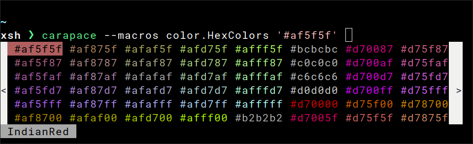

# v0.29 - Art Exchange


## Macros

`$_` prefix is now deprecated and needs to be replaced with `$carapace.`

```
$_color.HexColors
$carapace.color.HexColors
```

```sh
carapace _carapace macro color.HexColors ""
```

```sh
sed 's/$_/$carapace./g' ~/.config/carapace/specs/*.yaml
```
  
## Xonsh

Support for colored completion.



