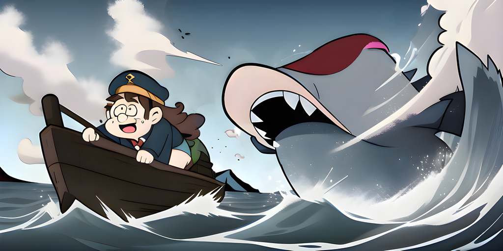

# v1.2 - Sea Change



Moby has grown a little too big.

## Docker

Split the `carapace` container into [several smaller ones](https://github.com/carapace-sh/docker).

## Compose

Updated compose services with the new docker containers.
Also added services for specific tools.


## Zsh

Reworked the handling of quoted values.


## VHS

Added [VHS] tapes to [verify](https://carapace-sh.github.io/carapace/development/vhs/word.html) the shell integration.


## Variable

Extracted the `set-env <NAME> <VALUE>` completion as generic action.


> Completions use the **local** environment so there are some limitations.

### Spec

In specs it can be used as **attached** (default) or **positional** completion.

```yaml
# yaml-language-server: $schema=https://carapace.sh/schemas/command.json
name: variable
completion:
  positional:
  - ["$carapace.env.NameValues"] # attached (NAME[=VALUE])
  - ["$carapace.env.NameValues(true) ||| $shift(1)"] # positional (NAME)
  - ["$carapace.env.NameValues(true) ||| $shift(1)"] # positional (VALUE)
```


> - Use [`shift`] to skip previous arguments during **positional** completion.
> - Renamed `env.KnownEnvironmentVariables` to `env.Names`.
> - Renamed `env.EnvironmentVariableValues` to `env.Values`.


## Unfiltered

Added `CARAPACE_UNFILTERED` environment variable to skip the final filtering step.


> This enables fuzzy completion in [fish] (to a degree), but is limited to mostly static values.

[fish]:https://fishshell.com/
[`shift`]:https://carapace-sh.github.io/carapace-spec/carapace-spec/macros/modifier.html#shift
[VHS]:https://github.com/charmbracelet/vhs
