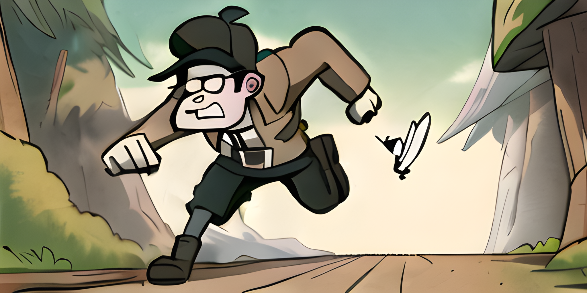

# v1.6 - GOOS Chase



Shedding some feathers from the release.

## Groups

Organized completers into [groups](../groups.md).

- `android` termux completers
- `bridge` bridged completers
- `bsd` bsd-like completers
- `common` common completers
- `darwin` macos completers
- `linux` linux completers
- `unix` unix-like completers
- `user` user specs
- `system` system specs
- `windows` windows completers


## Variants

Added support for [variants](../variants.md).


## Choices

The default priority of completers can be overridden with [choices](../choices.md).


> This replaces `bridges.yaml` which now has no effect and can be removed.

## Spec

Added extended flag notation for less common use cases.

- `nargs` amount of arguments consumed

```yaml
name: command
commands:
  - name: extended
    flags:
      --nargs-two=: {description: consumes two arguments, nargs: 2}
      --nargs-any=: {description: consumes multiple arguments, nargs: -1}
```


## Diff

`carapace --diff` now takes two arguments to compare [variants].


## Aws

Created [carapace-aws] to provide enriched completion for [aws-cli].


[aws-cli]:https://github.com/aws/aws-cli
[carapace-aws]:https://github.com/carapace-sh/carapace-aws
[variants]:../variants.md
