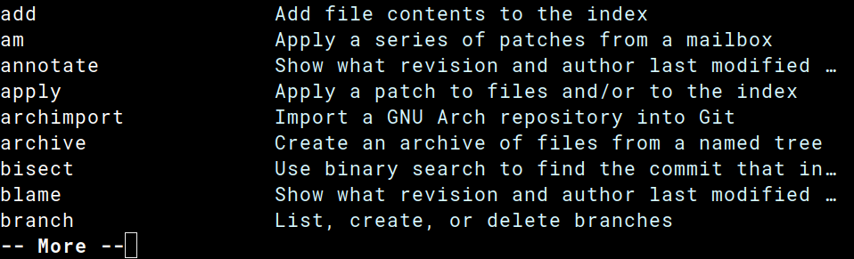
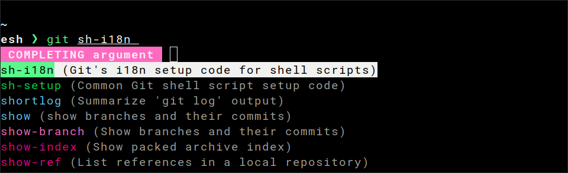
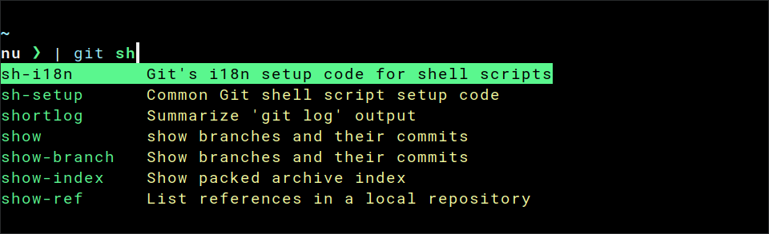
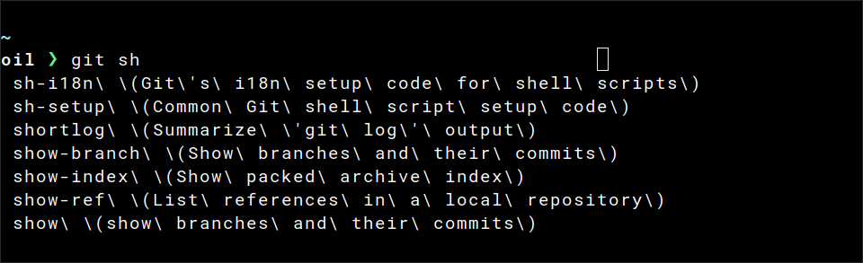
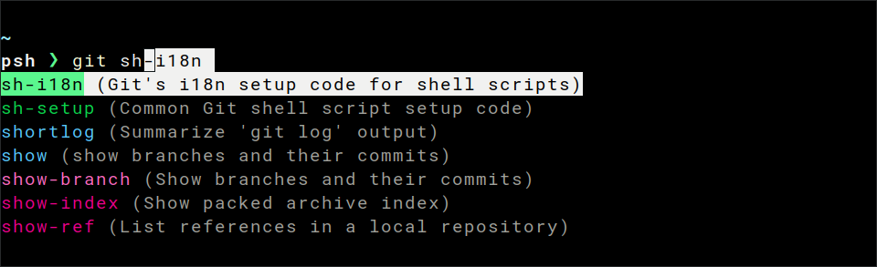
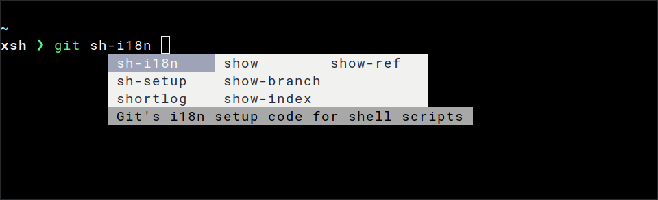

# Setup

> This registers all the available [completers](./completers.md).
> It is also possible to load a single one by replacing `_carapace` with the completer name (e.g. `carapace chmod`).

> **Note: Windows paths may vary due to various environments**

## Bash

```sh
# ~/.bashrc
export CARAPACE_BRIDGES='zsh,fish,bash,inshellisense' # optional
source <(carapace _carapace)
```


## Cmd

```lua
# ~/AppData/Local/clink/carapace.lua
load(io.popen('carapace _carapace cmd-clink'):read("*a"))()
```



> Needs [clink](https://chrisant996.github.io/clink/).

## Elvish

```sh
# ~/.config/elvish/rc.elv
set-env CARAPACE_BRIDGES 'zsh,fish,bash,inshellisense' # optional
eval (carapace _carapace|slurp)
```



## Fish

```sh
# ~/.config/fish/config.fish
set -Ux CARAPACE_BRIDGES 'zsh,fish,bash,inshellisense' # optional
carapace _carapace | source
```


> With [4.0b1](https://github.com/fish-shell/fish-shell/releases/tag/4.0b1) onwards the following workaround is not needed anymore:
> ```sh
> mkdir -p ~/.config/fish/completions
> carapace --list | awk '{print $1}' | xargs -I{} touch ~/.config/fish/completions/{}.fish # disable auto-loaded completions (#185)
> ```
> see [fish-shell/fish#6716](https://github.com/fish-shell/fish-shell/issues/6716)

## Nushell

```sh
# (Unix) ~/.config/nushell/env.nu
# (Windows) ~/AppData/Roaming/nushell/env.nu
$env.CARAPACE_BRIDGES = 'zsh,fish,bash,inshellisense' # optional
mkdir ~/.cache/carapace
carapace _carapace nushell | save --force ~/.cache/carapace/init.nu

# (Unix) ~/.config/nushell/config.nu
# (Windows) ~/AppData/Roaming/nushell/config.nu
source ~/.cache/carapace/init.nu
```



## Oil

```sh
# ~/.config/oil/oshrc
export CARAPACE_BRIDGES='zsh,fish,bash,inshellisense' # optional
source <(carapace _carapace)
```



## Powershell

```sh
# (Unix) ~/.config/powershell/Microsoft.PowerShell_profile.ps1
# (Windows) ~/Documents/PowerShell/Microsoft.PowerShell_profile.ps1
$env:CARAPACE_BRIDGES = 'zsh,fish,bash,inshellisense' # optional
Set-PSReadLineOption -Colors @{ "Selection" = "`e[7m" }
Set-PSReadlineKeyHandler -Key Tab -Function MenuComplete
carapace _carapace | Out-String | Invoke-Expression
```



## Tcsh
```sh
# ~/.tcshrc
setenv CARAPACE_BRIDGES 'zsh,fish,bash,inshellisense' # optional
set autolist
eval `carapace _carapace`
```


## Xonsh
```sh
# ~/.config/xonsh/rc.xsh
$CARAPACE_BRIDGES='zsh,fish,bash,inshellisense' # optional
$COMPLETIONS_CONFIRM=True
exec($(carapace _carapace))
```



## Zsh

```sh
# ~/.zshrc
export CARAPACE_BRIDGES='zsh,fish,bash,inshellisense' # optional
zstyle ':completion:*' format $'\e[2;37mCompleting %d\e[m'
source <(carapace _carapace)
```

Order of groups can be configured with the zstyle [group-order](https://zsh.sourceforge.io/Guide/zshguide06.html).
```sh
zstyle ':completion:*:git:*' group-order 'main commands' 'alias commands' 'external commands'
```


